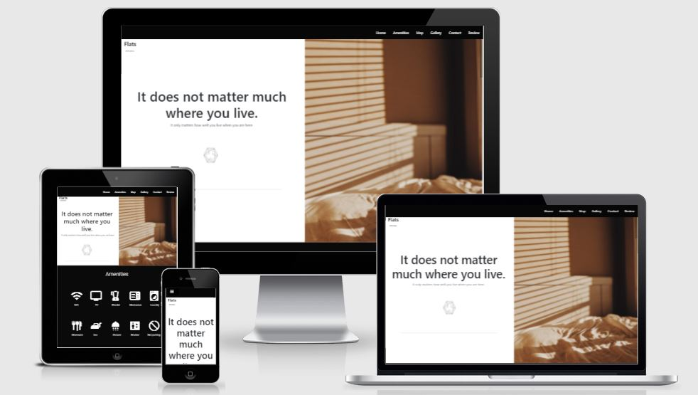

- [Visit site](https://juliandavid-garcia.github.io/second_milestone_project/index.html)
# Flats Armenia 
This site has relevant information about the apartments rented by Flats Armenia. Here visitors can find a description of the facilities as well as an inventory of some to the amenities offered in the apartment. 
In order to help guests to move around easily we added a map of the area where visitors obtain information related to restaurants, supermarkets, parkings, ATMs, and some other places of interest 

Potential Visitor can contact the fleet manager to discuss about the availability, to obtain extra information or even to make a direct reservation. 
However, Reservations are preferred via Airb&b
Due to the security guarantees this platform offers. Therefore, This site is linked to the Flats Armenia Airb&b profile so, those visitors who already have an account on this platform can preview and reserve via Airb&b.

## Index 

- <a href="#ux">1. User experience (UX)</a>
  - <a href="#Project">1.1. Project goals</a>
  - <a href="#User-story">1.2 User stories</a>
  - <a href="#Wireframes">1.3 Wireframes</a>
  - <a href="#Design">1.4 Design</a>
- <a href="#Features">2. Features</a>
- <a href="#Technologies">3. Technologies used</a>
- <a href="#Testing">4. Testing</a>
- <a href="#Deployment">5. Deployment</a>
- <a href="#Credits">6. Credits</a>
- <a href="#Media">7. Media</a>
- <a href="#Acknowledgements">8. Acknowledgements</a>
- <a href="#Github">9. 9. Github</a>

# UX 1.

This website is specially addressed to new guests and potential visitors to let them have an idea of what they will find when arriving to the apartment, as well as to provide them with the most useful information required when arriving to a new city.
Visitors can find in the interactive map the exact location of the apartment as well as those of some places of interest as museums, restaurants etc.

This site lets guests and potential visitors have a direct contact with the owner to solve any kind of questions that may arise.

## 1. 1 Project goals
- This website is specially addressed to guide guests during  their visit to the flat, as well as help potential visitors to make their mind when deciding to stay in the flat.

- Be intuitive for users and easy to navigate.  

- Inform users about what they will find when they come to the flat. 

- Encourage people to visit the flat. 

## 1. 2 User Story: 
### As a guest I want to:
- Find the address of the apartment 

- See images of the apartment 

- Check peoples reviews

- See the amenities provided 

- Make a reservation 

- Have direct contact with the owner of the flat. 

- Spot on a map the location of the flat and places of intrest ATMs, Supermarkets, etc..

- Check the public transportation availability. 

- Have access to its social media

## 1. 3  [Wireframes](wireframe.md)
[See Wireframes ](wireframe.md)

These wireframes where designed  with [Figma](https://www.figma.com/)
which is a very instuitive prototyping tool that focuses in the user interface and user experience design.

## 1. 4 Design

This website was designed thinking on a minimalist concept which transmits serenity and tranquillity and which reflects what is like to be on the apartment. Therefore, all pages are diaphanous but functional, avoiding the overuse of colors which could be stressful  and overwhelming for the users.
Hence, black, white and yellow are the predominant colors.

- **The Font:**  
  - Regarding the font "Roboto" and "Heebo" were used due to the perfect contrast, they offer making the site look clean and ordered. 

- **Colors:**
    -  **Black #000000:**  Color used for Navigation bar, Title color, Amenities background, Form alert background, Review section Background and Footer background.
    - **White #FFFFFF:** Color used for body background color, Icons used in the Amenities section, font used in the Navigation bar. Background in the Gallery and Contact sections. 
    - **Yellow #ffc107:** Color used for the badge, Form button, Icons in the amenities section when been hovered, Navigation links when hovered and to show the active class when a navigation link has been clicked. 
    - **Gray #ced4da:** Color used for the placeholders in the Form.

- **Input format:**
    The form in the page count with some security features to guide the user to introduce the data in a secured and correct way: 
    - **Email** box the users are required to enter an email in the  following order: characters@characters.domain (characters followed by an @ sign, followed by more characters, and then a "."After the "." sign, add at least 2 letters from a to z:pattern="[a-z0-9._%+-]+@[a-z0-9.-]+\.[a-z]{2,}$">.

    - **Name** in this box users need to add a name 
    with a length of max-50 and min-5 characters. These characters have to be numbers and upper and lower case letters. Following the pattern="^[^\s][A-Za-z0-9\s]{5,50}$".

    - **Message** in this box users can add the message to the administrator 
    with a length of max-400 and min-5 characters. These characters can be numbers and upper and lower case letters.

- **Alert:** When clicking on the icons located in the Amenities section the user will get an alert adding extra information related to each of the items selected. this is a feature that is only available for mobile devices since in  desktops  the icons already have an informative text below each icon. 
     

## 2. Features

### 2.1. Existing features

 The User can find all the features of this page attached to the navigation bar which fixed on upper side of the website. This Navigation bar is only displayed on screens with a min-width 768px.For mobile divices (max-768px) the feature are integrated in a hamburguer menu.
 These features are accessible on every page of the website. Therefore, all of them are interconnected, letting the user move around the pages no matter his/her location. 

### 2.1.1 Landing page:

This feature is the main page of the site.
Here users will come across with an image of the apartment that is been introduced and a navigation bar that links to all the features available on the site.  It also counts with a sentence that describes what we want to trasnmite to the possible guests. 

### 2.1.2 Navigation bar:  
Located in the top of the image contains the different sections of the website displayed on devices up to 768PX
Navigation Hamburguer menu:  This is the navigation option displayed on devices smaller than 768PX.
        

### 2.1.3 Contact:
 This feature can be reached through the menu or just scrolling to the section. Here the user  has a form  to  E-mail  the administrator of the flat.
 this form has some security requirements as placeholders and patterns that garantee that all input boxes are filled properly. 

### 2.1.4 Social media: 
Is located in the footer.
Here all the icons are  linked  to its corresponding website. 
Target="_blank" was used to avoid being kicked out of the side when clicking on the icon-link.

### 2.1.5 Amenities: 
This section has small icons that show what kind of services are offered in the apartment. When clicking on an icon user will get an alert with extra information regarding each item. This functionaliy is only available in devices  max-width 768px. In wider screens icons already have a description.

### 2.1.6 Gallery:
 This section displays all the images regarding the different parts of the apartment. kitchen, bathroom, livingroom. etc. In order to display de images to the users a carousel from boostrap was used. This component slides the images from right to left and also gives the chance to go forward or backward with the lateral bottons.

### 2.1.7 map:
In the Map section People can find where exactly the apartment is located as well as some other places of interest as supermarkets or bus stations. Here users can click on the icons suggested and get a window with extra information related to that place.
 
### 2.2 Future features:
When i aquire the knowledge required i would like to add a direct reservation calendar so as those used by Booking or airb&b.

## 3. Technologies Used
This website was built using:
- [HTML](https://html.com) **HTML**is used to create pages and make them functional.
- [CSS](https://css3.com) **Css** is used to style the page
- [JavaScript](https://JavaScript.com) **JavaScript** to make websites interactive.
- [Jquery](https://jquery.com) **Jquery** is a library that facilitates the use of javaScript in the site.
- [Boostrap](https://Boostrap.com) **Boostrap** is used also to style the page
- [Fontawesome](https://fontawesome.com/) **Fontawesome** used to add icons
- [Googlefont](https://fonts.google.com/) **Googlefont** used to set the font
- [Gitpot](http://gitpod.io/) **Gitpod** use to edit and built the page
- [Github](http://github.com/) **Github** use to storage the page 
- [Figma](http://figma.com/) **Figma** used to creat a wireframe or mock-up 
- [Photoshop](http://photoshop.com/) **Photoshop** used to edit the images used in the page. 
- [Responsivedesign](http://ami.responsivedesign.is/) **Responsive Design** to show how it looks in defferent devices. 
- [Google.API](https://developers.google.com/maps) **Google.API** Used to place the most important places as well as the location of the appartment in google maps.  
- [EmailJs](https://www.emailjs.com/) **EmailJS** Used to link my personal email to the website.
 

## 4. Testing
 
  - [Results Here](testing.md)

 
## 5. Deployment
### **5.1 Deploy your repository**
- **Open github**
- **Open workspace/second_milestone_project and go to setting.**

- **Open setting and scroll down until Github Pages**

- **Click on the None dropdowmenu and select the branch to publish : master**

-  **Click save**

- **The website is now deployed.**
- [Deployed site address](https://juliandavid-garcia.github.io/second_milestone_project/index.html)

## 5.2. To clon the repository using GitHub Desktop
- **Download and install GitHub Desktop**

 [Download GitHub Desktop](https://desktop.github.com/)

- **Open juliandavid-garcia/second-milestone-project**

- **Click on the button "Code"**

- **Select "Open with GitHub Desktop" to clone
 and open the respository with GitHub Desktop.**

- **Allow Github desktop to open the file you want to clone**

- **Choose where you want to save your cloned file**

- **Choose where you want to see your cloned document**

- **If you chose "show in explorer" you will see something like this**

## 6. Credits:
The slide right menu used for the devices up to 576px was taken from [w3schools :](https://www.w3schools.com/howto/howto_js_curtain_menu.asp)

- [Slide Right menu](https://getbootstrap.com/docs/4.1/components/dropdowns/)

The form was built following [Bootstrap](www.Bootstrap.com):

- [Form](https://getbootstrap.com/docs/5.0/forms/form-control/)

The icons where taken from:
- [Font awesome](https://fontawesome.com/icons)
- [Icons8](https://icons8.com/)

The Carousel effect used in the portfolio images was taken from : 
 - [Carousel](https://getbootstrap.com/docs/5.0/components/carousel/#with-captions)

The position of icons in the googlemaps is carried out to the instructions given by :
- [Google maps](https://m.youtube.com/watch?v=Zxf1mnP5zcw&t=1264s)

## 7. Media
The photos used in the review section were obtained from :

- [Unsplash](https://unsplash.com/photos/3N26kH--Tuo)

## 8. Acknowledgements

- I received inspiration for this project from the previous exercises made during the course. But also famous renting sites were used as a reference :
- [Airb&b](https://www.airbnb.es/)
- [Vrbo](https://vrbo.com/)

The landing page was inspired by the images from :
- [Tom Parkes](https://dribbble.com/shots/4108711-Dot-Landing-Page-Transitions)

The gallery section was inspired by the image of :
- [Tom Parkes](https://dribbble.com/shots/4847700-Habitat-67-Layout-Explorations)
- Thanks to [Precious Ijege](@Precious_Mentor) for his mentoring while developing this project. His advices, patience and support were of high relevance to carry out this project. 

- ## Github
You can find this project on 
[My Github](https://github.com/juliandavid-garcia)

