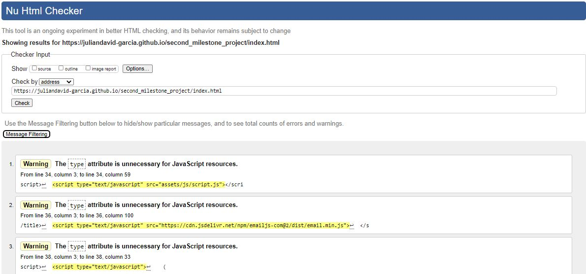

 ## Testing ##

- All the features of this project have been manually tested  in order to make sure they respond effectively. Moreover, users can move from page to page since all of them are interconnected. 

 - Contact form:
When filling the form if the information required in the contact form is not correct (wrong email format, or not filling the text boxes.) an error message about the required fields will appear. 

As part of the testing process this website was tested using:
 - [W3C Markup Validator](https://validator.w3.org/) 
 - [Jigsaw W3C CSS Validator](https://jigsaw.w3.org/css-validator/)

## W3C Markup Validator

- ## Landing page ##

- ## Contact page ##

## W3C CSS Validator

 This web has been tested in desktop devices using the following browser:

 - [Mozila fire fox](https://www.mozilla.org/en-US/firefox/new/)
 - [Opera](https://www.opera.com/)
 - [Chrome](https://www.google.com/chrome/)
 - [windows Explorer](https://www.microsoft.com/en-us/edge).

 In all these browsers the apparience, images and responsiveness worked perfectly. 

 

 ## Responsiveness ##

This website is responsive. Consequently, it has been developed to  be displayed on any device. 
The main changes users can evidence when accessing the site on a different device are:
On devices up to 576 PX  there is not Carousel display in the landing page. 

As illustrated in the image below, this website has been tested in all devices  available in the Google chrome Developer tool. The results are the followings:

As we can see the website responds effectively in all devices. However, in the desktop version theres is an undesired right-margin in the landing page which still need to be investigated in order to be removed
## Bugs ##

### Bug 1. ###
- There is a right margin that cant be removed in the sections that contains the carousel from boostrap.

### Bug 2. ###
- When restricting the google API my map does not work

### Bug 3. ###
- In devices  with a width smaller than 780px, the user need to zoon the screen out in order to fit the size of the image to the screen. 

## Testing users' stories ##
### As a guest I want to:
- **Find the address of the apartment**
If you check the map you can find the location of the flat. However, the exact address is given to the guest when the reservation is confirmed 

- **See images of the apartment**
In the Gallery section people can have access to all the images of the apartment 
- **Find the instruction on how to arrive to the flat**
Following the google maps direction people can arrive to the flat easily.
- **See the amenities provided** 
In the section Amenities people can find a list of the most outstanding services found in the flat
- **Make a reservation** 
People can contact the flat manager in order to set a reservation or can also make direct reservation through the airb&b wesite which is linked to the site. 
- **Have direct contact with the owner of the flat.** 
There is a contact form for people to reach the flats owner in order to ask questions or make direct reservations
- **Spot on a map the location of the flat and places of intrest ATMs, Supermarkets, etc..**
In the map provided in the site people can find relevant information for the visitors such as the supermakets, banks and even the location of the flat
- **Check the public transportation availability.** 
User can find in the map where are the bustops closes to the flat and which are the routes that take you there. 
- **have access to its social media**
  
  - In the footer the user can find all the links to the social media of the apartment.
    
    - [Instagram](https://www.instagram.com/)
    - [Airb&b](https://www.airb&b.com/)
   
 

 

