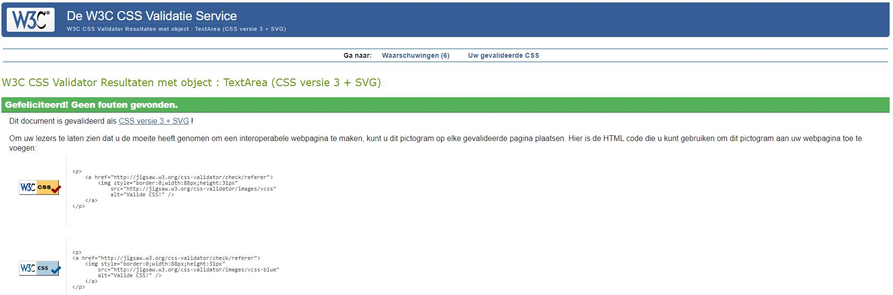
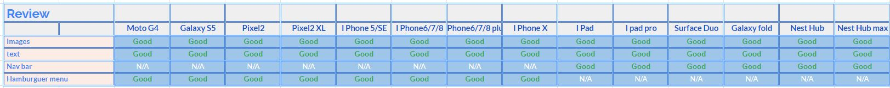

 ## Testing ##

- All the features of this project have been manually tested  in order to make sure they respond effectively:
Through both menus(extended navigation bar and hamburguer navigation menu) users can reach every section of the website. 
- the contact form has  been tested and it works perfectly. A confirmation message pops up to confirm that the message has been sent.
 When filling the form if the information required in the contact form is not correct (wrong email format, or not filling the text boxes.) an error message about the required fields will appear. 

- The map is working perfectly and the infowindows worked as expected in all devices. 

- In the Amenities section all the alerts show up when clicking on the icons.

- The site had been developed to fit the sizes of the different devices provided by google developers tools. Therefore, this page is responsive in all those devices.   

As part of the testing process this website was tested using:
 - [W3C Markup Validator](https://validator.w3.org/) 
 - [Jigsaw W3C CSS Validator](https://jigsaw.w3.org/css-validator/)
 - [Jshint](https://jshint.com/)
## W3C Markup Validator

- ## Html ##
- There are some warnings regarding the Attribute type. I dont dare to remove those attribute since they correspond to links from the documentation in emailjs and google maps API. 

## W3C CSS Validator

- 

## Js hint Validator
- ## script.js ##

 This web has been tested in desktop devices using the following browser:

 - [Mozila fire fox](https://www.mozilla.org/en-US/firefox/new/)
 - [Opera](https://www.opera.com/)
 - [Chrome](https://www.google.com/chrome/)
 - [windows Explorer](https://www.microsoft.com/en-us/edge).

 In all these browsers the apparience, images and responsiveness worked perfectly. 

 

 ## Responsiveness ##

This website is responsive. Consequently, it has been developed to  be displayed on any device. 
The main changes users can evidence when accessing the site on a different device are:
On devices up to 576 PX  there is not landing image displayed. 

As illustrated in the image below, this website has been tested in all devices  available in the Google chrome Developer tool. The results are the followings:

As we can see the website responds effectively in all devices.
## Bugs ##

### Bug 1. ###
- There was a right margin that could not be removed in the sections that contains the carousel from boostrap. 
  - I had to remove this carousel in order to get rid of the margin. 

### Bug 2. ###
- When restricting the google API my map does not work.

### Bug 3. ###
- In devices  with a width smaller than 780px, the user needed to zoon the screen out in order to fit the size of the image to the screen. 
  - After having removed the carousel from the landing page the size of the whole site was adjusted. 

### Bug 4. ###
- When placing the emailjs function in the scripts.js file, the email shows an error. 
  - Following the emailjs documentation the emailjs function "type="text/javascript">
    (function () {
      emailjs.init("user_EbLvG3iACRgi6RcDBExzK");
    })();"  has to come in the html file in order to make it work.   

### Bug 5. ###
- When working with the emailjs i could not manage to get a confirmation alert.
  - I replaced "console.log("SUCCESS", response);" for "alert("Email sent successfully!"  

## Testing users' stories ##
### As a guest I want to:
- **Find the address of the apartment**
  - If you check the map you can find the location of the flat. However, the exact address is given to the guest when the reservation is confirmed 

- **See images of the apartment**
  - In the Gallery section people can have access to all the images of the apartment 
- **Find the instruction on how to arrive to the flat**
  - Following the google maps direction people can arrive to the flat easily.
- **See the amenities provided** 
  - In the section Amenities people can find a list of the most outstanding services found in the flat
- **Make a reservation** 
  -  People can contact the flat manager in order to set a reservation or can also make direct reservation through the airb&b wesite which is linked to the site. 
- **Have direct contact with the owner of the flat.** 
  - There is a contact form for people to reach the flats owner in order to ask questions or make direct reservations
- **Spot on a map the location of the flat and places of intrest ATMs, Supermarkets, etc..**
  - In the map provided in the site people can find relevant information for the visitors such as the supermakets, banks and even the location of the flat
- **Check the public transportation availability.** 
  - User can find in the map where are the bustops closes to the flat and which are the routes that take you there. 
- **have access to its social media**
  
  - In the footer the user can find all the links to the social media of the apartment.
    
    - [Instagram](https://www.instagram.com/)
    - [Airb&b](https://www.airb&b.com/)
   
 

 

